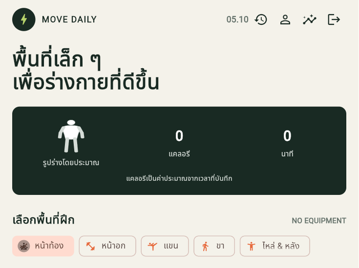
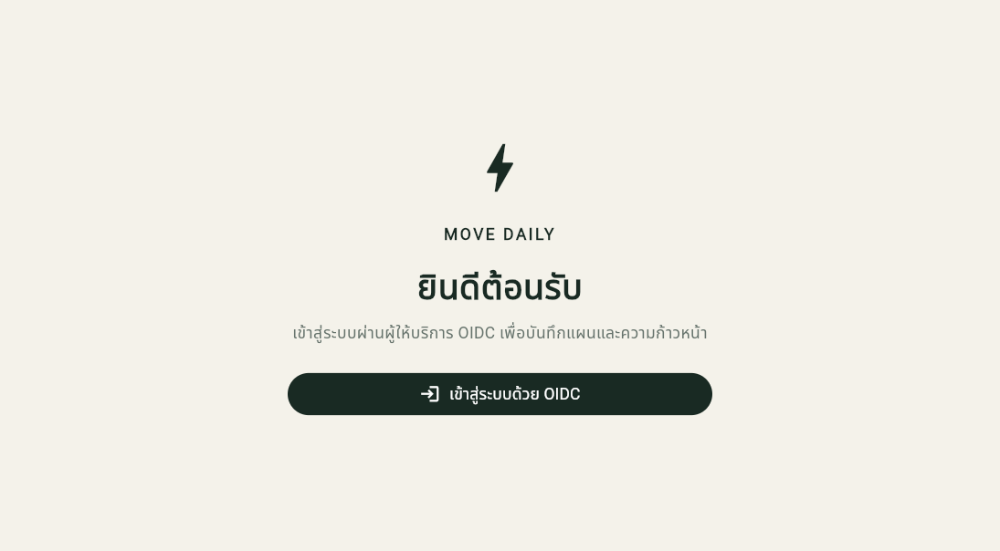

# Move Daily — แอปออกกำลังกายที่บ้าน

Move Daily เป็นแอป Flutter สำหรับผู้ที่ต้องการเริ่มหรือรักษาวินัยการออกกำลังกายที่บ้านโดยไม่ใช้อุปกรณ์ เชื่อมต่อ Django REST API และใช้ OpenID Connect (OIDC) สำหรับยืนยันตัวตน

## 1. คำอธิบายโปรเจกต์

แอปช่วยจัดแผนออกกำลังกายตามส่วนของร่างกายและระดับความยาก มีแผนฝึก 28 วันพร้อมคำแนะนำและภาพสาธิตท่า บันทึกประวัติและสรุปความก้าวหน้าไว้ในบัญชีของผู้ใช้

## 2. ฟีเจอร์

### ฟีเจอร์หลัก

- เข้าสู่ระบบและออกจากระบบด้วย OIDC Authorization Code Flow + PKCE
- สมัครบัญชีใหม่ด้วยอีเมลและรหัสผ่านที่ตรวจสอบความปลอดภัยฝั่ง Django
- ป้องกันหน้าข้อมูลด้วยสถานะการเข้าสู่ระบบ และกู้คืนเซสชันเมื่อเปิดแอปอีกครั้ง
- เลือกพื้นที่ฝึก: หน้าท้อง หน้าอก แขน ขา หรือไหล่และหลัง
- เลือกระดับเริ่มฝึก ปานกลาง หรือขั้นสูง พร้อมดูแผนฝึก 28 วัน
- ดูท่าฝึกทีละท่า พร้อมภาพสาธิต คำแนะนำ และตัวนับเวลาสำหรับท่าค้าง
- บันทึกประวัติ ดูรายละเอียด แก้ไขเวลา และลบรายการฝึกของบัญชีตนเอง
- จัดการข้อมูลโปรไฟล์ ได้แก่ เพศ อายุ น้ำหนัก และส่วนสูง
- Dashboard แสดงจำนวนท่าที่ฝึก แคลอรีรวมโดยประมาณ และนาทีฝึกสะสม
- บันทึกประวัติน้ำหนัก แสดงกราฟแนวโน้ม และเตือนในแอปเมื่อครบกำหนดอัปเดตรายสัปดาห์
- แสดงข้อผิดพลาดจาก API เมื่อเชื่อมต่อไม่ได้หรือคำขอไม่สำเร็จ

### ฟีเจอร์เสริม

- กราฟความก้าวหน้ารายสัปดาห์ 8 สัปดาห์
- คำแนะนำระดับเริ่มต้นจากอายุและประวัติการฝึก
- วันพักฟื้นหลังฝึกสำเร็จติดต่อกัน 3 วัน และวันพักตามแผน
- ภาพเงารูปร่างโดยประมาณจากส่วนสูงและน้ำหนักในโปรไฟล์

คำแนะนำระดับเป็นข้อมูลประกอบ ไม่ใช่การประเมินทางการแพทย์ แคลอรีคำนวณโดยประมาณด้วยสูตร MET × 3.5 × น้ำหนัก (กก.) ÷ 200 × เวลา (นาที) โดยใช้ค่า MET ประมาณการตามระดับฝึก: เริ่มฝึก 3.5, ปานกลาง 5.0 และขั้นสูง 7.0; หากยังไม่มีน้ำหนักในโปรไฟล์ ระบบจะไม่คำนวณรายการนั้น ยอดรวมจึงรวมเฉพาะรายการที่มีค่าคำนวณได้ รายการที่บันทึกก่อนเปลี่ยนสูตรยังคงค่าเดิมไว้ แคลอรีไม่ใช่การวัดพลังงานที่เผาผลาญจริง

การเตือนน้ำหนักเป็นการเตือนภายในแอปเมื่อเปิด Dashboard หรือหน้าความก้าวหน้า ไม่ใช่ push notification; การบันทึกน้ำหนักจากกราฟหรือแก้ไขน้ำหนักในโปรไฟล์จะเก็บเป็นประวัติพร้อมวันที่และอัปเดตค่าน้ำหนักปัจจุบัน

## 3. Tech Stack และสถาปัตยกรรม

- **Frontend:** Flutter และ Dart
- **Backend:** Django, Django REST Framework และ SQLite สำหรับการพัฒนา
- **Authentication:** `django-oidc-provider` และ OIDC Authorization Code Flow + PKCE (S256)
- **Token storage:** `flutter_secure_storage` ผ่าน `oidc_default_store`
- **Dependency injection:** `provider` และ `MultiProvider`
- **โครงสร้างแอป:** View → ViewModel → Repository → Service
- **Error handling:** Result Pattern ใน Data Layer และแจ้งข้อผิดพลาดใน UI
- **Backend environment/dependencies:** `uv`

## 4. Prerequisites

ติดตั้งเครื่องมือเหล่านี้ก่อนเริ่ม:

- [Git](https://git-scm.com/downloads)
- [Flutter SDK](https://docs.flutter.dev/get-started/install) พร้อม Chrome สำหรับรัน Flutter Web
- [uv](https://docs.astral.sh/uv/getting-started/installation/)
- [Python 3.11 ขึ้นไป](https://www.python.org/downloads/) (หรือให้ `uv` จัดการ Python ให้)

ตรวจสอบการติดตั้ง:

```powershell
git --version
flutter --version
uv --version
```

## 5. How to Run

คู่มือนี้เป็นขั้นตอนสำหรับ Windows และ PowerShell โดยต้องเปิด Backend กับ Flutter ค้างไว้พร้อมกันใน **Terminal แยกกัน 2 หน้าต่าง** ค่า `localhost`, พอร์ต `3000` และพอร์ต `50000` ต้องตรงกันตลอดการเข้าสู่ระบบ OIDC

### ขั้นที่ 1 — เตรียมเครื่องมือและเปิดโฟลเดอร์โปรเจกต์

ติดตั้ง Git, Flutter SDK, Chrome และ `uv` ตามลิงก์ในหัวข้อ Prerequisites จากนั้นเปิดโฟลเดอร์ที่ clone โปรเจกต์ไว้ด้วย VS Code (ตัวอย่างตำแหน่ง `C:\MoblieDev69\home_workout_app`; หากเก็บไว้ที่อื่น ให้ใช้ตำแหน่งของคุณแทน)

ใน VS Code เลือก **Terminal > New Terminal** แล้วตรวจสอบว่าตำแหน่งปัจจุบันเป็นโฟลเดอร์รากของโปรเจกต์:

```powershell
Get-Location
```

ผลลัพธ์ควรลงท้ายด้วย `home_workout_app` หากไม่ใช่ ให้ย้ายไปยังโฟลเดอร์โปรเจกต์ (แก้ path ให้ตรงกับตำแหน่งที่เก็บโปรเจกต์):

```powershell
Set-Location C:\path\to\home_workout_app
```

ตรวจสอบเครื่องมือ:

```powershell
git --version
flutter --version
uv --version
```

### ขั้นที่ 2 — เปิด Django Backend (Terminal 1)

เปิด Terminal แรก แล้วรันคำสั่งต่อไปนี้ทีละบรรทัดจากโฟลเดอร์รากของโปรเจกต์:

```powershell
uv sync --project backend --locked
$env:DJANGO_SECRET_KEY = "local-development-only-change-this"
$env:OIDC_ISSUER_URL = "http://localhost:3000"
$env:OIDC_REDIRECT_URI = "http://localhost:50000/redirect.html"
$env:DEMO_USER_PASSWORD = "MoveDailyDemo!2026"
uv run --project backend python backend\manage.py migrate
uv run --project backend python backend\manage.py setup_demo
uv run --project backend python backend\manage.py runserver 0.0.0.0:3000
```

รอจนเห็นข้อความว่ากำลังรันที่พอร์ต `3000` แล้ว **อย่าปิด Terminal นี้** คำสั่ง migrate และ setup_demo จำเป็นสำหรับการเตรียมเครื่องครั้งแรก; หลังดึงโค้ดรุ่นใหม่ให้รัน `uv run --project backend python backend\manage.py migrate` ก่อนเปิด Server เพื่อใช้ schema ล่าสุด เมื่อฐานข้อมูลตั้งค่าแล้ว ในการเปิดครั้งถัดไปให้กำหนดตัวแปร `$env:DJANGO_SECRET_KEY`, `$env:OIDC_ISSUER_URL`, `$env:OIDC_REDIRECT_URI` และ `$env:DEMO_USER_PASSWORD` ใหม่ใน Terminal แล้วรันเฉพาะคำสั่ง `runserver`

`setup_demo` เตรียมบัญชีสาธิตและ OIDC client สำหรับ PKCE คำสั่งสามารถเรียกซ้ำได้ และจะตั้งรหัสผ่านของบัญชีสาธิตตามค่า `DEMO_USER_PASSWORD` ที่กำหนด

### ขั้นที่ 3 — เปิด Flutter Web (Terminal 2)

เปิด Terminal ใหม่อีกหน้าต่าง (อย่าหยุด Terminal 1) และตรวจให้แน่ใจว่าอยู่ที่โฟลเดอร์รากของโปรเจกต์ จากนั้นรัน:

```powershell
flutter pub get
flutter run -d chrome --web-port 50000 --dart-define=OIDC_ISSUER_URL=http://localhost:3000/oidc --dart-define=OIDC_DISCOVERY_URL=http://localhost:3000/oidc/.well-known/openid-configuration --dart-define=OIDC_REDIRECT_URI=http://localhost:50000/redirect.html --dart-define=OIDC_CLIENT_ID=movedaily-flutter
```

รอจน Flutter เปิด Chrome และตรวจแถบที่อยู่ว่าเป็น `http://localhost:50000` ห้ามใช้พอร์ตสุ่มอื่น เช่น `63129` และห้ามสลับ `localhost` เป็น `127.0.0.1` เพราะ redirect URI ที่ลงทะเบียนกับ OIDC client ต้องเป็น `http://localhost:50000/redirect.html`

### ขั้นที่ 4 — สมัครบัญชีหรือเข้าสู่ระบบ

1. ที่หน้า Move Daily กด **เข้าสู่ระบบผ่าน OIDC**
2. สำหรับบัญชีใหม่ ให้กด **สร้างบัญชีใหม่** ที่หน้า Sign in ของ Move Daily กรอกอีเมล รหัสผ่าน และยืนยันรหัสผ่าน พร้อมกรอกข้อมูลส่วนตัว (เพศ อายุ น้ำหนัก ส่วนสูง) หากต้องการ แล้วกดสร้างบัญชี ระบบจะกลับไปทำขั้นตอน OIDC ต่อ
3. หากใช้บัญชีสาธิต ให้กรอก `demo@example.com` และ `MoveDailyDemo!2026`
4. หากปรากฏหน้า **Request for Permission** ให้กด **Authorize** เพื่ออนุญาตการเข้าถึงข้อมูลโปรไฟล์และอีเมล
5. เมื่อกลับมาที่ `http://localhost:50000` สำเร็จ หน้าแอปจะแสดง Dashboard

### การหยุดและเปิดแอปครั้งถัดไป

- หยุดแต่ละเซิร์ฟเวอร์โดยคลิก Terminal ที่เกี่ยวข้องแล้วกด **Ctrl+C**
- เปิดใช้งานครั้งถัดไป ให้เริ่ม Backend ใน Terminal 1 และ Flutter ใน Terminal 2 ตามขั้นตอนข้างต้น โดยไม่จำเป็นต้องสั่ง migrate หรือ setup_demo ซ้ำ หากไม่ได้ลบฐานข้อมูล
- ตัวแปร `$env:...` อยู่เฉพาะ Terminal ปัจจุบัน เมื่อเปิด Terminal ใหม่ต้องกำหนดตัวแปรของ Backend อีกครั้ง
- หากหน้า Login ยังไม่มีปุ่ม **สมัครสมาชิก** หลังแก้ไขโค้ด ให้หยุด Django server ที่เปิดอยู่ทุก Terminal ด้วย **Ctrl+C** ก่อน เพราะอาจมีหลาย instance ใช้พอร์ต `3000` อยู่ จากนั้นตรวจให้ไม่มีตัวฟังพอร์ตเหลือ แล้วเปิด Backend เพียงครั้งเดียว:

```powershell
Get-NetTCPConnection -LocalPort 3000 -State Listen |
  Select-Object LocalAddress, LocalPort, OwningProcess
```

ถ้าคำสั่งยังแสดง process ให้กลับไปยัง Terminal ที่รัน Django process นั้นและกด **Ctrl+C** ก่อนตรวจซ้ำ เมื่อไม่มีผลลัพธ์แล้ว ให้เริ่ม Backend ตามขั้นที่ 2 เพียงหน้าต่างเดียว จากนั้นเปิด `http://localhost:3000/accounts/register/` เพื่อตรวจหน้าสมัคร หรือกลับไปลองเข้าสู่ระบบผ่าน OIDC อีกครั้ง
- หากแจ้งว่าพอร์ต `50000` ถูกใช้งาน ให้ตรวจและหยุด Flutter instance เดิมก่อน อย่าเปิด Flutter ซ้ำหลายครั้ง:

```powershell
Get-NetTCPConnection -LocalPort 50000 -State Listen |
  Select-Object LocalAddress, LocalPort, OwningProcess
```

หากเห็นหน้าโหลดค้างหลัง Authorize ให้ตรวจว่า Flutter ยังทำงานอยู่และ URL ใน Chrome เป็น `localhost:50000` ส่วน Backend ต้องยังทำงานที่พอร์ต `3000`

### Android Emulator

ค่า API เริ่มต้นของ Android Emulator คือ `http://10.0.2.2:3000/api` ส่วนค่า OIDC issuer/discovery ต้องเข้าถึง backend ได้จาก emulator ด้วย หากใช้ IP อื่น ให้กำหนด `OIDC_ISSUER_URL`, `OIDC_DISCOVERY_URL` และ `OIDC_REDIRECT_URI` ให้สอดคล้องกันทั้ง Flutter และ Django OIDC client ก่อนรัน

## 6. Demo Account

บัญชีสำหรับสาธิตที่สร้างด้วยคำสั่งในหัวข้อ How to Run:

- **Username:** `demo@example.com`
- **Password:** `MoveDailyDemo!2026`

รหัสผ่านนี้ใช้เฉพาะฐานข้อมูลในเครื่องสำหรับการสาธิต คำสั่ง `setup_demo` รับรหัสผ่านจากตัวแปร `DEMO_USER_PASSWORD` หรือถามแบบ interactive และไม่ฝังรหัสผ่านไว้ในแอป

## 7. Screenshots

### หน้า Dashboard



### หน้าเข้าสู่ระบบ OIDC



## 8. Demo Video

**สถานะ: รออัปโหลดวิดีโอสาธิตแบบ Unlisted ไปยัง YouTube**

> ใส่ลิงก์ YouTube (Unlisted) ที่นี่ เช่น: `https://youtu.be/...`

## 9. การเตรียมระบบสำหรับใช้งานจริงบนอินเทอร์เน็ต (Deploy บน Render)

โปรเจกต์มี `render.yaml` และ `Dockerfile` สำหรับ deploy Flutter Web กับ Django API ใน Web Service เดียว และใช้ Render PostgreSQL เป็นฐานข้อมูลถาวร วิธีนี้ทำให้แอป, API และ OIDC ใช้ origin เดียวกัน

1. Push โค้ดขึ้น GitHub แล้วสร้าง **Blueprint** ใหม่จาก repository นี้บน Render โดยเลือก branch `project` ที่ต้องการ deploy
2. ตรวจสอบแผนและค่าใช้จ่ายก่อนยืนยัน: Web Service ตั้งเป็น Free ซึ่งอาจ sleep เมื่อไม่มีการใช้งาน ส่วน PostgreSQL ตั้งเป็น `basic-256mb` ซึ่งเป็นบริการแบบมีค่าใช้จ่าย อย่ากดยืนยันหากยังไม่ยอมรับค่าใช้จ่ายของฐานข้อมูล
3. Render จะ build Flutter Web และ Django, รัน migration และตั้งค่า public OIDC client ให้อัตโนมัติ ตรวจสถานะ health ที่ `/api/health`
4. เปิด URL ของ Web Service แล้วสร้างบัญชีใหม่ที่ `/accounts/register/`; ระบบไม่ได้สร้างบัญชี demo หรือฝังรหัสผ่านสำหรับ production
5. หากใช้ custom domain ให้ตั้ง `PUBLIC_ORIGIN` เป็น `https://<โดเมน>` และเพิ่มโดเมนเดียวกันใน `DJANGO_ALLOWED_HOSTS` จาก Environment ของ Web Service แล้ว deploy ใหม่ เพื่อให้ OIDC issuer และ redirect URI ตรงกับโดเมนจริง

ยังไม่ได้สร้างบริการหรือ deploy จริงในบัญชี Render; Blueprint จะเริ่มสร้างทรัพยากรและฐานข้อมูลเมื่อคุณเชื่อม repository และยืนยันใน Render เท่านั้น

## การทดสอบ

รันจากโฟลเดอร์รากของ repository:

```powershell
uv run --project backend python backend\manage.py test workouts
uv run --project backend python backend\manage.py check
uv run --project backend python backend\manage.py makemigrations --check --dry-run
flutter test
flutter analyze
```

## หมายเหตุความปลอดภัย

ค่าคีย์และการตั้งค่าเริ่มต้นมีไว้สำหรับการพัฒนาในเครื่องเท่านั้น ก่อนใช้งานจริงต้องตั้ง `DJANGO_DEBUG=0`, ใช้ `DJANGO_SECRET_KEY` ที่เก็บเป็นความลับ, จำกัด `DJANGO_ALLOWED_HOSTS` และ CORS, ใช้ HTTPS และตั้งค่า OIDC redirect URI ให้เป็น HTTPS ที่ตรงกับ client
